# Banking Retail Analytics Platform: System Design

Version 1.0 · AWS · Batch + CDC ingestion · Medallion layout (Raw → Cleansed → Curated → Serving)

---

## 1. Scope and assumptions

| Item | Assumption (change if wrong) |
|---|---|
| Source entities | Branches, Customers, Products, Transactions |
| Load types | Baseline (Day 1 full history), Incremental (CDC after Day 1) |
| Latency target | Incremental batch available in Redshift within 2 hours of source cut-off |
| Volume | Transactions: tens of millions of rows/day at peak (size Glue workers and partitions to this) |
| Regions | Single primary region with DR copy of raw and curated buckets (cross-region replication) |
| KPIs | 13 KPIs defined in a KPI register (see §11). Definitions not provided, so they are placeholders |
| Compliance | PII and financial data; encryption at rest and in transit, audit logging, least privilege |

---

## 2. Architecture overview

```mermaid
flowchart LR
    subgraph SRC["Source systems"]
        S1["Branches"]
        S2["Customers"]
        S3["Products"]
        S4["Transactions"]
    end

    SRC -->|"DMS full load (Day 1)"| RAW
    SRC -->|"DMS CDC (Day 2+)"| RAW

    RAW[("S3 RAW / Bronze\nimmutable, versioned, Object Lock")]
    RAW -->|"manifest.json ObjectCreated"| EB["EventBridge rule"]
    EB --> Q["SQS main queue"]
    Q -. "maxReceiveCount=5" .-> DLQ["SQS DLQ"]
    Q --> REG["Lambda: batch registrar"]
    REG <--> CTL[("DynamoDB batch_control")]
    REG --> SFN["Step Functions orchestrator"]

    SFN --> DIM{{"Stage 1: Dimensions (parallel Map)"}}
    DIM --> GC1["Glue: clean + validate"]
    GC1 --> CUR1["Glue: curated dims (Iceberg MERGE / SCD2)"]
    CUR1 --> FACT{{"Stage 2: Facts (after dims)"}}
    FACT --> GC2["Glue: clean + validate + ref checks"]
    GC2 --> CUR2["Glue: fact_transaction (Iceberg MERGE)"]

    GC1 -->|"invalid"| QUAR[("S3 Quarantine")]
    GC2 -->|"invalid"| QUAR

    CUR2 --> CUR[("S3 Curated / Gold\nIceberg, Glue Catalog")]
    CUR1 --> CUR
    CUR --> RSLOAD["Redshift Data API: COPY + MERGE"]
    RSLOAD --> RS[("Redshift Serverless\ndw tables + KPI MVs")]
    RS --> BI["QuickSight dashboards / reports"]

    SFN --> REC["Lambda: reconciliation"]
    REC --> AUD[("DynamoDB / Redshift batch_audit")]
    SFN -->|"Catch"| ALERT["SNS: ops alerts"]
```



Cleansed (Silver) Parquet is written by the clean job as intermediate, per-batch output. Curated is the source of truth for modeled data. Redshift is the serving layer only.

---

## 3. Component design

### 3.1 Source ingestion

| Concern | Design |
|---|---|
| Baseline (Day 1) | AWS DMS full load from each source DB to S3 raw, Parquet output, one prefix per entity. |
| Incremental | DMS CDC (log-based) into the same raw prefixes, with an `Op` column (`I`, `U`, `D`) and a `commit_ts` column. If a source cannot support log-based CDC, use a watermark column (`updated_at`) with a Glue extract. |
| Producer completeness | The producer writes all data files first and `manifest.json` last. The manifest is the only trigger and the completion marker. |
| manifest.json | `batch_id`, `entity`, `load_type` (BASELINE / INCREMENTAL), `cutoff_ts`, `files[]` (key, row_count, sha256), `total_rows`, `schema_version`. |

### 3.2 Raw (Bronze) storage

- Bucket: `bank-dl-raw-<env>`. Key layout (Hive-style, explicit):
  `raw/entity=<entity>/load_type=<baseline|incremental>/dt=YYYY-MM-DD/batch_id=<id>/part-*.parquet` and `.../manifest.json`
- Versioning enabled. S3 Object Lock in compliance mode for the retention period required by regulation (value TBD by compliance).
- Lifecycle: Standard for 90 days, then S3 Glacier Instant Retrieval (retention per policy).
- Bucket policy denies unencrypted uploads and non-TLS access. Default SSE-KMS with a customer-managed key (CMK).
- Replication to the DR region.

### 3.3 Event trigger and buffering

- EventBridge rule: `Object Created` on `raw/**/manifest.json` only. This avoids one event per data file.
- Target: SQS standard queue (`raw-batch-events`) with visibility timeout ≥ registrar Lambda timeout. Encrypted with KMS.
- DLQ (`raw-batch-events-dlq`) with `maxReceiveCount = 5`. CloudWatch alarm when DLQ depth > 0.
- Registrar Lambda uses partial batch responses (`ReportBatchItemFailures`) so one bad message does not block the rest.

### 3.4 Batch registrar (Lambda)

Steps, in order:
1. Read `manifest.json` from S3.
2. Verify that every file in the manifest exists and matches its `sha256` and `row_count` (row counts come from file metadata or a manifest-declared count).
3. Check the schema version against the schema registry.
4. Write `batch_control` item with a conditional put (`attribute_not_exists(batch_id)`). A duplicate delivery is a no-op.
5. Start the Step Functions execution with `name = batch_id`. Step Functions rejects duplicate execution names, which gives idempotency for free.

`batch_control` (DynamoDB):

| Key | Attributes |
|---|---|
| PK `batch_id`, SK `entity` | `load_type`, `status` (RECEIVED → VALIDATED → PROCESSING → LOADED / FAILED), `cutoff_ts`, `raw_rows`, `clean_rows`, `quarantine_rows`, `curated_rows`, `started_at`, `ended_at`, `error` |

### 3.5 Orchestrator (Step Functions, Standard workflow)

```
ValidateBatch (Lambda)
  └─ Choice: load_type
Stage1_Dimensions  (Map over [branches, products, customers], MaxConcurrency=3)
   ├─ CleanValidate (Glue sync)
   └─ CurateDimension (Glue sync)   // customers = SCD2, others = Type 1 or Type 2 per KPI need
Stage2_Facts  (runs only after Stage1 succeeds)
   ├─ CleanValidate (Glue sync, includes referential checks)
   └─ CurateFact (Glue sync)        // fact_transaction MERGE
RedshiftLoad (Redshift Data API: COPY staging, MERGE into dw tables, REFRESH MVs)
Reconcile (Lambda)                  // count + amount checks, see §6
MarkLoaded (Lambda)
Catch (any state) → MarkFailed (Lambda) → Notify (SNS)
```

Rules applied to all Glue and Lambda tasks:
- Retry: `MaxAttempts = 3`, `BackoffRate = 2`, retry on `States.TaskFailed` and Glue throttling errors. Do not retry on schema or data errors.
- Timeouts: set `TimeoutSeconds` on every task.
- Use `.sync` integrations so the orchestrator waits for Glue job completion.

Reprocessing: rerunning a `batch_id` is safe because every curated write is an idempotent `MERGE` on the business key.

### 3.6 Clean and validate (Glue PySpark)

Pipeline stages inside each clean job:

1. **Read raw** with the schema from the Glue Schema Registry (or a versioned JSON contract). Reject files whose schema does not match.
2. **Type casting and standardization**: timestamps to UTC, amounts to `DECIMAL(18,2)`, currency codes to ISO 4217, IDs trimmed and upper-cased, phone and national ID formats normalized.
3. **Deduplication** on business key:
   - Customers: `customer_id`
   - Products: `product_id`
   - Branches: `branch_id`
   - Transactions: `(source_system, transaction_id)`
   - Tie-breaker: highest `commit_ts`, then `updated_at`. For CDC, drop superseded records, and keep `D` as a delete flag.
4. **Data quality rules** loaded from a versioned config file (`s3://bank-dl-config/dq/<entity>.yaml`), not hardcoded:
   - Not-null on keys, and on mandatory fields such as `account_id` and `amount`
   - Domain checks (e.g. `txn_type` in a code list, `amount` ≠ 0 unless reversal)
   - Range and format checks (dates not in the future, valid currency)
5. **Referential checks** (Transactions only): `account_id` exists in `dim_customer` (current version), `product_id` in `dim_product`, `branch_id` in `dim_branch`.
   - If a key is missing from the curated dimension but present in the same batch's dimension output, it passes. Dimensions are processed first, so this is the normal case.
   - If it is still missing, the row is quarantined with reason `MISSING_DIM`. Missing-dimension rows are re-queued by the reprocess workflow when the dimension arrives.
6. **Split output**:
   - Valid → `s3://bank-dl-cleansed/<entity>/batch_id=<id>/` (Parquet, Snappy)
   - Invalid → `s3://bank-dl-quarantine/<entity>/batch_id=<id>/` with columns `error_code`, `error_detail`, `rule_id`, plus the original record as a JSON string.
7. **Metrics** written to CloudWatch (per entity: raw, valid, quarantine counts, quarantine %).

Quarantine threshold: if quarantine rate for an entity exceeds the configured limit (default 0.5%), the job fails with `QUARANTINE_THRESHOLD_EXCEEDED`. A bad upstream feed then stops at the batch boundary instead of loading partially.

### 3.7 Curated layer (Gold, Iceberg)

Format: Apache Iceberg tables in the AWS Glue Data Catalog, stored on `bank-dl-curated`. Iceberg provides `MERGE INTO`, time travel, and schema evolution. Plain Parquet does not support these.

| Table | Grain / key | Load pattern | Partitioning | Notes |
|---|---|---|---|---|
| `dim_customer` | `customer_sk` (surrogate); natural key `customer_id` | SCD2: `valid_from`, `valid_to`, `is_current`, `row_hash` | none or `is_current` | Compare `row_hash` (SHA-256 of tracked columns) to skip unchanged rows. CDC `D` closes the current version and sets `is_deleted`. |
| `dim_product` | `product_sk`; `product_id` | Type 1 MERGE (Type 2 if product attributes must be historized for reporting) | none | Small table |
| `dim_branch` | `branch_sk`; `branch_id` | Type 1 MERGE | none | Small table |
| `fact_transaction` | `(source_system, transaction_id)` | MERGE on key; updates and reversals applied | `transaction_date` (+ bucket on `account_id` if needed) | Largest table. Compaction job daily. |

Surrogate keys are generated during the dimension merge and resolved in the fact job by joining on natural key with `is_current = true` (or by the validity window `txn_ts` between `valid_from` and `valid_to` if point-in-time accuracy is required; recommended for customer attributes such as branch assignment).

Maintenance: Iceberg `expire_snapshots` and `rewrite_data_files` run daily, scheduled from Step Functions or EventBridge Scheduler.

### 3.8 Serving layer (Redshift Serverless)

- Workgroup in private subnets, base capacity sized from load tests, max RPU capped for cost control.
- Schemas: `staging` (COPY targets, truncated per batch), `dw` (dimension and fact tables, with `DISTKEY`/`SORTKEY` set), `kpi` (materialized views).
- Load path:
  1. `COPY` curated Parquet/Iceberg data into `staging.*` via the IAM role attached to the workgroup. Alternatively, define a Redshift Spectrum external schema over the Glue Catalog and skip the copy.
  2. `MERGE` from staging into `dw.*` in one transaction (Redshift Data API `BatchExecuteStatement`).
  3. `REFRESH MATERIALIZED VIEW kpi.*`.
- Users: separate roles for loader, analyst, and BI. Row-level security for branch managers where needed.
- Audit logging enabled (connection, user activity, and user log) and shipped to a secured S3 bucket.

### 3.9 Quarantine and reprocessing

- Quarantine files are browsable through an Athena view `quarantine.v_<entity>`.
- Reprocess workflow (Step Functions, manually or event triggered): accepts `batch_id` or `error_code` filter, reruns the clean job on the quarantined records after the upstream fix or missing dimension has arrived, and writes results into curated with the same MERGE logic.
- Owner: data steward. SLA for resolving quarantine items: defined per entity (placeholder).

### 3.10 Consumption

- QuickSight: SPICE or direct query against Redshift. Row-level security on branch and region.
- KPI register: a version-controlled YAML or table listing each of KPI 1–13 with name, definition, grain, source tables, owner, refresh cadence, and the MV that implements it. Each KPI MV references this register.

---

## 4. Security and compliance

| Control | Implementation |
|---|---|
| Encryption at rest | KMS CMKs per data zone (raw, curated, redshift, sqs), automatic key rotation enabled |
| Encryption in transit | TLS everywhere; `aws:SecureTransport` deny on S3 buckets |
| Network | VPC with private subnets for Glue, Redshift, and Lambda. VPC endpoints (gateway for S3, interface for Glue, Step Functions, SQS, DynamoDB, KMS, Redshift Data API, CloudWatch Logs) so no traffic goes over the internet. |
| Access control | Lake Formation for database, table, and column permissions on the Glue Catalog. Per-job IAM roles with least privilege. |
| PII | National ID, DOB, phone, email, and account number are tokenized or masked in the curated layer. Only a `pii_reader` role sees clear values. Masking is applied with Lake Formation column filters or a view. |
| Sensitive data discovery | Amazon Macie on the raw bucket, scheduled scans, findings to Security Hub |
| Audit | CloudTrail management and S3 data events; Redshift audit logs; Step Functions and Glue logs to CloudWatch with a retention policy |
| Secrets | Source DB credentials in AWS Secrets Manager with rotation |
| Change control | Glue scripts, Step Functions definitions, DQ configs, and KPI register in Git. Deploy via CloudFormation or CDK with pipeline approval for production. |

---

## 5. Observability

| Signal | Tool | Alarm |
|---|---|---|
| SQS DLQ depth | CloudWatch | > 0 for 5 min |
| Step Functions failed executions | CloudWatch / EventBridge | any failure → SNS |
| Glue job failures and duration (vs. baseline) | CloudWatch | failure, or duration > 2× 14-day average |
| Quarantine rate per entity | Custom metric | > threshold |
| Data freshness | Custom metric: `now − cutoff_ts` at MarkLoaded | > SLA (2 h) |
| Redshift load latency and query errors | Redshift metrics | p95 > baseline |
| Cost | AWS Budgets + Cost Anomaly Detection | forecast > budget |

Dashboards: one per layer (ingestion, clean, curated, serving) plus a batch-level view driven by `batch_control`.

---

## 6. Reconciliation and data quality controls

Executed in the Reconcile step for every batch. Results are written to `batch_audit`.

1. **Row counts**: `manifest.total_rows` = raw rows read = clean valid + quarantined (for each entity).
2. **Control totals**: sum of `amount` in source extract vs. sum in cleansed valid rows (for transactions), tolerance 0.
3. **Key coverage**: distinct business keys in curated = expected from clean output for the batch.
4. **Redshift parity**: row count and control total in `dw.fact_transaction` for `batch_id` = curated.
5. Any failed check sets the batch to `FAILED` and blocks the MarkLoaded step. The data stays in curated but is flagged in `batch_control`. Consumers should not read batches that are not `LOADED` (see §7 for the publish pattern).

**Publish pattern**: Redshift MERGE runs inside a transaction together with the audit write. A failed reconciliation rolls back the transaction, so dashboards keep showing the previous good state.

---

## 7. Failure handling and recovery

| Failure | Handling |
|---|---|
| Manifest checksum mismatch | Registrar marks `FAILED`, sends alert; producer re-sends the batch |
| Duplicate SQS delivery | Conditional put on `batch_control` + Step Functions execution name uniqueness |
| Glue transient error | Step Functions retry with backoff |
| Glue data or schema error | No retry; batch `FAILED`; alert to data engineering |
| Quarantine above threshold | Job fails; batch `FAILED`; upstream owner notified |
| Missing dimension for fact row | Quarantine with `MISSING_DIM`; reprocessed later |
| Redshift load failure | Transaction rollback; retry from RedshiftLoad state |
| Partial curated write | Iceberg commits are atomic per table; rerun batch is idempotent |
| Region outage | Restore raw and curated from DR replica; redeploy stacks in DR region |

---

## 8. Cost and performance

- Glue: use Flex execution for non-urgent batches, G.1X workers, job bookmarks disabled (CDC handles incrementals), Glue 4.0+ with Iceberg support.
- Partition pruning: `transaction_date` partitions on the fact table, and the `dt` key on raw and cleansed.
- Iceberg compaction daily; target file size 128–512 MB.
- Redshift Serverless: set max RPU, use materialized views for the 13 KPIs, and schedule `REFRESH` after the load rather than on demand.
- S3 lifecycle to IA and Glacier for raw and quarantine after policy-defined periods.
- Athena for ad-hoc and quarantine review, with workgroup bytes-scanned limits.

---

## 9. Deployment and environments

- Environments: `dev`, `test`, `prod`, each in its own AWS account, with a shared Glue Catalog account if cross-account access is needed.
- IaC: AWS CDK or Terraform for buckets, KMS, IAM, DMS, EventBridge, SQS, Step Functions, Glue, Redshift.
- CI/CD: unit tests for PySpark transforms (pytest + local Spark), contract tests for schemas, Step Functions definition validation, then deploy with manual approval to prod.
- Backfill: a Step Functions workflow that accepts a date range and replays raw batches in order.

---

## 10. Changes made from the first-draft review

| # | Issue in v0 | Fix in this design |
|---|---|---|
| 1 | Transactions not routed through the orchestrator | Stage 2 Facts in Step Functions |
| 2 | No dimension-before-fact ordering | Stage 1 Dimensions completes before Stage 2 |
| 3 | SCD2 and MERGE on plain Parquet | Iceberg tables in the Glue Catalog |
| 4 | No Redshift load step | COPY/Spectrum + MERGE via Redshift Data API |
| 5 | Ambiguous S3 key layout | Explicit Hive-style key with entity, load_type, dt, batch_id |
| 6 | Per-file events and no batch completeness | manifest.json as the single trigger and completion marker |
| 7 | Source ingestion and CDC not defined | DMS full load and CDC, with watermark fallback |
| 8 | Quarantine is a dead end | Athena view, reprocess workflow, owner and SLA |
| 9 | No DLQ or failure handling | SQS DLQ, Step Functions retry and Catch, batch state machine |
| 10 | No idempotency | Conditional put, execution name uniqueness, MERGE on business keys |
| 11 | Dedup key undefined | Business keys per entity and tie-breaker rules |
| 12 | Quality rules hardcoded | Versioned YAML rule config, quarantine threshold |
| 13 | No reconciliation | Row count, control total, key coverage, Redshift parity checks |
| 14 | No security or PII controls | KMS, VPC endpoints, Lake Formation, masking, Macie, CloudTrail |
| 15 | No observability | Alarms, freshness metric, batch dashboard |
| 16 | Immutability not enforced | Versioning and Object Lock on raw |
| 17 | No DR | Cross-region replication and recovery procedure |

---

## 11. KPI register (template)

| KPI | Name | Definition | Grain | Source | MV | Owner | Refresh |
|---|---|---|---|---|---|---|---|
| KPI 1 | TBD | TBD | TBD | TBD | `kpi.mv_kpi_01` | TBD | After each batch |
| … | … | … | … | … | … | … | … |
| KPI 13 | TBD | TBD | TBD | TBD | `kpi.mv_kpi_13` | TBD | After each batch |

Fill this with the actual KPI definitions. Each KPI must name its grain and source tables so the MV can be traced back to the curated layer.

---

## 12. Open items

1. Source database types and whether log-based CDC is supported (determines DMS vs. watermark extract).
2. Retention periods and regulatory requirements for raw and curated data (drives Object Lock and lifecycle settings).
3. Expected daily and peak volumes (drives Glue sizing and Redshift RPU).
4. Customer attributes that need point-in-time accuracy (decides SCD2 join pattern in the fact load).
5. The 13 KPI definitions.
6. Quarantine rate threshold and resolution SLA per entity.
7. Whether Redshift Spectrum or COPY is preferred for the serving load.
