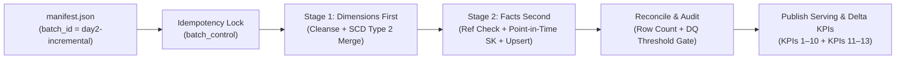

# Incremental Processing Design (Day 1 Baseline → Day 2 Delta)

This document explains how the RetailBank pipeline absorbs incremental data drops (`day2-incremental` and beyond)—handling new records, attribute changes on existing dimensions, and late-arriving transaction corrections—**without reprocessing historical data from scratch or double-counting facts**.

---

## 1. End-to-End Incremental Flow

Every batch (`day1-baseline` or `day2-incremental`) runs through the same parameterized pipeline (`pipeline/run_local.py` / AWS Glue job `deploy/glue/pipeline_runner.py`), governed by five core mechanisms:

---

## 2. Five Core Mechanisms

### 2.1 Manifest-Driven Completeness & Idempotency (`register`)
* **Single Trigger (`manifest.json`):** Incremental files (`branches_2.csv`, `customer_updates_2.csv`, `products_2_json.txt`, `transactions_2.csv`) land in S3 Bronze under `raw/load_type=incremental/dt=2026-10-02/batch_id=day2-incremental/`. Processing only begins when `manifest.json` is written last and every file's `sha256` checksum passes verification.
* **Idempotent Replay:** Before running, the registrar checks `batch_control` (DynamoDB in AWS / `out/control/batch_control.json` locally).
  * If `batch_id` is already `LOADED`, re-running the batch is a safe no-op.
  * Even if forced to re-merge, dimension `row_hash` comparison and fact `transaction_id` upserts guarantee zero duplicate rows.

### 2.2 Strict Two-Stage Ordering (Dimensions Before Facts)
Incremental drops contain transactions belonging to **brand-new Day 2 customers, products, or branches**.
* **Stage 1 (`stage_dimensions`)** runs first, cleansing and merging `branches`, `products`, and `customers` into Gold (`dim_branch`, `dim_product`, `dim_customer`).
* **Stage 2 (`stage_facts`)** runs **only after Stage 1 completes**, validating foreign keys (`account_id`, `product_id`, `branch_id`) against the freshly updated Gold dimensions. Any transaction whose foreign key is still absent is quarantined with `error_code = 'MISSING_DIM'` (`TX-RI-ACCT`, `TX-RI-PROD`, `TX-RI-BR`) rather than silently dropped.

### 2.3 SCD Type 2 on Dimensions (`pipeline/curate.py :: scd2_merge`)
All three dimensions (`dim_customer`, `dim_product`, `dim_branch`) preserve attribute history using **Slowly Changing Dimension Type 2**:
1. **Change Detection via `row_hash`:** A deterministic SHA-256 hash (`row_hash`) is computed over business-tracked attributes:
   * `dim_customer`: `customer_name`, `email`, `phone`, `account_id`, `gender`, `dob`, `address`, `kyc_status`, `registration_date`
   * `dim_product`: `product_name`, `product_type`, `price`, `launch_date`, `is_active`, `category`, `vendor_name`
   * `dim_branch`: `branch_name`, `location`, `manager_name`, `opened_date`, `region`, `branch_type`, `contact_number`
2. **Three Merge Outcomes at `cutoff_ts` (`2026-10-02T00:00:00`):**
   * **New Natural Key:** Inserted with a new surrogate key (`*_sk`), `valid_from = cutoff_ts`, `valid_to = 9999-12-31`, `is_current = True`.
   * **Existing Key, Unchanged `row_hash`:** Ignored (`unchanged += 1`) — prevents spurious version inflation when an upstream feed re-sends unchanged rows.
   * **Existing Key, Changed `row_hash` (e.g., KYC `Pending` → `Verified`):**
     * The prior active version is closed: `valid_to = cutoff_ts`, `is_current = False`.
     * A new version is inserted with a new surrogate key (`*_sk`), `valid_from = cutoff_ts`, `valid_to = 9999-12-31`, `is_current = True`.

### 2.4 Point-in-Time Surrogate Key Resolution (`resolve_sk`)
When linking transactions in Stage 2 to SCD2 dimensions, `resolve_sk` matches each transaction's timestamp (`txn_ts`) against the dimension version active at that moment (`valid_from <= txn_ts < valid_to`), falling back to `is_current = True` if the transaction predates the window. This ensures historical transactions retain their point-in-time dimension context.

### 2.5 In-Place Fact Upsert for Late Corrections (`upsert_fact`)
`transactions_2.csv` includes both new Day 2 transactions and **late-arriving corrections** that reuse an existing Day 1 `transaction_id` with a revised `amount` or `status`.
* `upsert_fact` matches incoming valid rows against `gold/fact_transaction` on `transaction_id`:
  * **New `transaction_id`:** Inserted with `first_batch_id = 'day2-incremental'` and `loaded_batch_id = 'day2-incremental'`.
  * **Existing `transaction_id` (Correction):** Replaces the existing row **in-place**, preserving the original `first_batch_id = 'day1-baseline'` while updating `loaded_batch_id = 'day2-incremental'`, `amount`, `status`, and `is_correction = True`.
* Because corrections update in-place rather than appending a second row, net revenue and volume KPIs never double-count.

### 2.6 Atomic All-or-Nothing Publish & Rollback
Before Stage 1 begins, the current Gold directory is snapshotted (`gold_backup`). After Stage 2 finishes, `reconcile()` verifies `raw == clean + rejected` for every entity and `quarantine_rate_check()` verifies data-quality reject rates are within threshold.
* If any check fails, Gold is restored from `gold_backup`, the batch is marked `FAILED`, and serving views remain untouched on Day 1 data.
* Only after all checks pass is the batch marked `LOADED` and published to the Serving Layer (`kpi.publish`).

---

## 3. Actual Day 2 Incremental Run Results (`day2-incremental`)

From `out/control/batch_audit_day2-incremental.json`:

| Entity | Raw Received | Clean Passed | Quarantined | Incremental Merge Breakdown |
|---|---:|---:|---:|---|
| **Branches** (`branches_2.csv`) | 2 | 2 | 0 | **1 new** branch inserted, **1 unchanged** (no-op after standardization) |
| **Products** (`products_2_json.txt`) | 18 | 18 | 0 | **9 new** products inserted, **9 changed** (SCD2 price/status versions created) |
| **Customers** (`customer_updates_2.csv`) | 47 | 47 | 0 | **22 new** customers inserted, **16 changed** (SCD2 KYC/address versions created), **9 unchanged** |
| **Transactions** (`transactions_2.csv`) | 199 | 135 | 64 *(26 DQ + 38 `MISSING_DIM`)* | **126 new** transactions inserted, **9 late corrections** updated in-place |

---

## 4. How Incremental KPIs (KPI 11–13) Leverage This Design

* **KPI 11 (`sql/kpi_11_day2_reconciliation.sql`):** Reads `batch_changes` (recording every `new`/`changed`/`unchanged` dimension count and `inserted`/`updated`/`corrected` fact count) alongside `kpi_snapshot` (which snapshots KPI 1 and KPI 7 after `day1-baseline` and compares them against `day2-incremental`).
* **KPI 12 (`sql/kpi_12_kyc_transitions.sql`):** Queries `dim_customer` across SCD2 versions (`is_current = FALSE` vs. `is_current = TRUE` for the same `customer_id`) to surface every customer whose `kyc_status` transitioned on Day 2 (e.g., `Pending` → `Verified`).
* **KPI 13 (`sql/kpi_13_day2_activation.sql`):** Uses `fact_transaction.first_batch_id` and `dim_customer.valid_from` to identify accounts transacting for the very first time in Day 2 and newly onboarded Day 2 customers with zero prior transactions.
