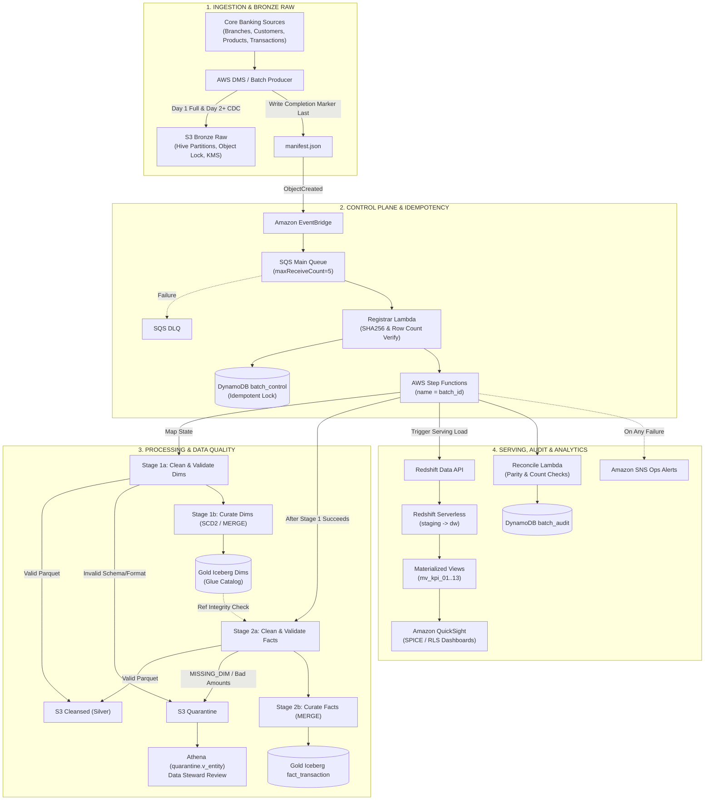

# RetailBank Customer Transaction Analytics Platform

A batch analytics platform on AWS for RetailBank's branches, customers, products, and transactions.
It loads a Day 1 baseline and a Day 2 incremental drop, cleanses and validates both, keeps history
(SCD Type 2 for dimensions), and serves 13 KPIs.

- Region: `ap-southeast-2`
- Runbook (commands, deployment steps, known issues): [docs/runbook.md](docs/runbook.md)
- Design rationale and review Q&A: [docs/design_defense.md](docs/design_defense.md)
- Full target design: [banking_retail_system_design.md](banking_retail_system_design.md)

---

## 1. High-Level Architecture



### What is built today

Some parts of the diagram above are planned rather than built. This table shows the difference.

| Area | Diagram | Built | Status |
|---|---|---|---|
| Ingestion | DMS full load and CDC | Batch files landed by `deploy/deploy.py` with `manifest.json` written last | Partial (DMS planned) |
| Trigger | EventBridge, SQS main queue, DLQ after 5 receives | Same | Built |
| Registrar | SHA-256 and row-count verification, DynamoDB conditional put, named execution | SHA-256 verified; conditional put; execution named batch + S3 version id | Built (row counts not yet verified) |
| Orchestration | Map over dimensions, then facts | Step Functions runs one Glue job that does both stages in order | Simplified |
| Processing | Glue PySpark | Glue Python shell (pandas + DuckDB), same code runs locally | Simplified |
| Silver / Quarantine | S3 Parquet, quarantine with `error_code` and raw payload | Same | Built |
| Gold | Iceberg tables with MERGE | Parquet folders; merge logic in Python, full rewrite per batch | Simplified |
| Reconcile | Lambda with four invariants | Row-count check and reject threshold inside the Glue job | Partial |
| Serving | Redshift Serverless, materialized views, QuickSight | Athena views over Gold; dashboard generated from Athena | Simplified (QuickSight blocked by an SCP) |
| Alerts | SNS on failure | SNS topic; rules for Glue failures, Step Functions failures, DLQ, Lambda errors | Built |

---

## 2. Layer-by-Layer Specification

### Layer 1: Ingestion and Bronze (raw)

- **Bucket:** `retailbank-raw-<env>-<account>`, versioned, with Object Lock in prod (`GOVERNANCE`, 7-year default; `COMPLIANCE` is an option once compliance confirms).
- **Layout:** `raw/load_type=<baseline|incremental>/dt=<YYYY-MM-DD>/batch_id=<id>/<file>`
- **Completion marker:** `manifest.json` is written last. It is the only event that starts processing.

```json
{
  "batch_id": "day2-incremental",
  "load_type": "incremental",
  "dt": "2026-10-02",
  "cutoff_ts": "2026-10-02T00:00:00",
  "schema_version": "1.0",
  "files": [
    {"entity": "customers", "key": "customer_updates_2.csv",
     "sha256": "…", "bytes": 6225, "row_count": 47}
  ]
}
```

**Why `manifest.json` triggers the pipeline:** the producer writes several files for one batch. Triggering on each file would start several runs while the batch is still uploading. Triggering on the manifest waits until every file is there.

### Layer 2: Control plane and idempotency

1. EventBridge matches `ObjectCreated` events for `manifest.json` in the raw bucket and sends them to the SQS queue.
2. Messages that fail five times go to the DLQ, and an alarm fires.
3. The registrar Lambda reads the manifest, checks each file's SHA-256 against the manifest, and writes `batch_id` to DynamoDB with `attribute_not_exists(batch_id)`. A duplicate delivery fails that write and is skipped.
4. It starts the Step Functions execution. Execution names stay reserved after a run, so the name is `batch_id` plus the S3 version id, which is unique per upload.

### Layer 3: Orchestration

```
RunBatchGlueJob  (glue:startJobRun.sync)
  Retry: Glue.ConcurrentRunsExceededException, 20 attempts, 60 s apart
  Catch: any other error -> BatchFailed
```

- The Glue job allows one run at a time. Two batches writing the same Gold tables at once would corrupt them, so the retry waits for the running batch to finish.
- Each batch runs Stage 1 (branches, products, customers) and then Stage 2 (transactions) in one job. A batch never reaches Stage 2 without Stage 1 finishing.
- A failed batch leaves Gold in its pre-batch state. The job restores the snapshot it took at the start.

### Layer 4: Cleansing and data quality

Stage 1 (dimensions):

| Entity | Rules |
|---|---|
| Customers | Exact and near duplicates on `customer_id` (kept: fewest flags); conflicting duplicates quarantined; email case and `@@` fixed, invalid emails nulled; phones normalized to `+91-XXXXXXXXXX`; KYC status normalized; DOB in the future, under 18, or over 110 quarantined; two customers on one account: the one whose ID matches the account is kept, the other quarantined; registration dates in several formats, day-first assumed when ambiguous |
| Branches | Duplicates by `branch_id`; region and branch type normalized; missing manager set to `UNASSIGNED`; `(New)` label stripped; invalid phone nulled |
| Products | `products_json.txt` repaired when an object is missing its comma (recorded in the batch audit); duplicate `product_id` with different prices quarantined; negative prices quarantined, not auto-corrected; `is_active` normalized, missing defaults to false |

Stage 2 (transactions):

| Rule | Behaviour |
|---|---|
| Amount | `₹`, commas, and `Rs.` stripped; blank, zero, and negative amounts quarantined |
| Date and timestamp | Timestamp is the authority; a disagreeing date is reconciled to it and flagged; a future date column or timestamp is quarantined |
| Status and payment method | Typos normalized (`Succes` → `SUCCESS`); unknown values quarantined |
| Refund flag | `Y`, `1`, `True` → true; `N`, `0`, `False` → false; blank defaults to false and is flagged |
| Duplicates | Exact copies dropped (logged); different values on the same ID: all copies quarantined |
| Late corrections | Rows marked `[late correction]` update the existing fact row in place |
| Referential integrity | Account, product, and branch must exist in the Gold dimensions; otherwise quarantined as `MISSING_DIM` |

Every rejected row is kept in the quarantine with its rule ID, error code, and raw payload. Repaired rows load with a flag in `dq_flags`.

Current results (both batches): 1,679 rows received, 1,291 passed, 388 quarantined. Details in
`dq_report/dq_report.html`.

### Layer 5: Gold (curated)

- **Dimensions** `dim_customer`, `dim_branch`, `dim_product`: SCD Type 2. Each has `*_sk`, `valid_from`, `valid_to`, `is_current`, and `row_hash`. A changed `row_hash` on an existing key closes the old version at the batch cutoff and opens a new one. An unchanged `row_hash` does nothing, so reruns are safe.
- **Fact** `fact_transaction`: one row per `transaction_id`. A correction updates `amount` and `status` in place, so nothing is double-counted. Surrogate keys point to the dimension version valid at the transaction time (point-in-time).
- **Format:** Parquet in folders, with microsecond timestamps so Athena can read them. Apache Iceberg (with `MERGE` and time travel) is the planned upgrade.

### Layer 6: Serving and reconciliation

- **Serving:** the 13 KPIs are Athena views over the Gold tables. The same SQL runs on DuckDB locally and produces identical results.
- **Reconciliation per entity:** `raw rows = clean rows + rejected rows`. The batch fails if any entity's data-quality reject rate exceeds its threshold (25% placeholder, `MISSING_DIM` excluded).
- **Planned:** control-total checks on amounts, key coverage, and warehouse parity (see the design doc).

### Layer 7: Security and operations

| Control | Status |
|---|---|
| KMS customer-managed key with rotation (prod) | Built |
| S3 Object Lock on raw (prod) | Built |
| TLS-only bucket policies, server access logs (prod) | Built |
| Lambda, Glue, and Step Functions logs with retention (prod) | Built |
| Alarms and failure alerts through SNS | Built |
| Least-privilege IAM per job | Built (scoped roles) |
| Lake Formation column masking for PII | Planned |
| VPC endpoints for private traffic | Planned |
| Macie scans on the raw bucket | Planned |

Phone, email, DOB, and address are present in the customer data. The repo is private, and the quarantine files contain these fields.

---

## 3. Worked Example: Real Rows From Day 2

Three real records from the Day 2 batch show how the pipeline handles them.

1. **KYC change, customer `C007`:** status changed from `Pending` to `Verified` on 2026-10-02.
   Stage 1 compared the new `row_hash` with the stored one, closed the Pending version at the cutoff, and opened a new current version. Both versions are kept, which is how KPI 12 reports the transition.
2. **Point-in-time link, transaction `T0741`:** account `A0007`, dated 2026-03-31, `SUCCESS`, 93,273. It predates the change, so Stage 2 links it to the Pending version of `C007`. A later report still shows the status that applied when the transaction happened.
3. **Rejected row, transaction `T9084`:** amount `-112836` on account `A0053`. It fails the amount rule first and is quarantined as `AMOUNT_NEGATIVE`. It is not reported as a missing dimension, because the amount check runs before the referential check. It is kept in quarantine with its raw payload.

Reconciliation for the file: `raw = clean + rejected`, and the batch is marked `LOADED`.

---

## 4. KPIs

| # | KPI |
|---|---|
| 1 | Top 5 customers by net transaction volume (refunds subtracted; ties broken by transaction count) |
| 2 | Monthly volume per branch and region, with month-over-month % |
| 3 | Product revenue, share of category, and period-over-period change |
| 4 | Dormant accounts (no successful transaction in 90 days); `High-Risk Dormant` for Credit Card and Loan |
| 5 | Suspicious transactions: amount over 100,000, three or more in 10 minutes, or between 00:00 and 05:00 |
| 6 | RFM segments (Platinum, Gold, Silver, Bronze) from tertiles on recency, frequency, and value |
| 7 | Branch ranking within region (`RANK` and `DENSE_RANK`; top and bottom performers) |
| 8 | Value share by customer KYC status |
| 9 | Refund count and value rate by product and branch |
| 10 | Data-quality scorecard per file and batch, with top rejection reasons |
| 11 | Day 2 reconciliation: new, updated, and corrected counts; KPI 1 and 7 deltas against Day 1 |
| 12 | KYC transitions between Day 1 and Day 2 |
| 13 | New account activations on Day 2 |

Definitions and assumptions: successful INR transactions for value KPIs; all statuses for monitoring (KPI 5);
non-INR amounts are flagged and excluded, not converted. SQL is in [sql/](sql/). Current results are in
[kpi_output/](kpi_output/) (prod copy) and the dashboard in [dashboard/](dashboard/).

---

## 5. Repository layout

| Path | Contents |
|---|---|
| `Retailbank_SourceData/` | Day 1 and Day 2 source files |
| `pipeline/` | Cleansing, SCD2, fact upsert, batch orchestration, serving layer |
| `sql/` | The 13 KPI definitions |
| `deploy/` | CloudFormation templates (`template.yaml` dev, `template.prod.yaml` prod), deploy script, Glue runner, dashboard builder |
| `tests/` | Unit tests for the cleansing rules, dedup, SCD2, and fact upsert (32 tests) |
| `dq_report/` | Data-quality and reject report |
| `dashboard/` | KPI dashboard generated from Athena |
| `docs/` | Operations runbook and design defence |
| `out/` | Local pipeline outputs (generated, not committed) |

## 6. Running it

```bash
# Local
python -m pytest tests -q
python -m pipeline.run_local day1
python -m pipeline.run_local day2

# AWS (prod)
python deploy/deploy.py --env prod stack
python deploy/deploy.py --env prod package
python deploy/deploy.py --env prod upload day1
python deploy/deploy.py --env prod upload day2
python deploy/deploy.py --env prod athena
python deploy/build_dashboard.py --env prod
```

See [docs/runbook.md](docs/runbook.md) for prerequisites, the order of steps, cost notes, and known issues.

## 7. Open items

1. Confirm the 25% reject threshold per entity with the data owners.
2. Confirm the retention mode (`GOVERNANCE` or `COMPLIANCE`) with compliance.
3. Confirm day-first for ambiguous dates, and whether non-INR amounts should be converted.
4. Confirm the KPI definitions where the brief is open (success-only rule, RFM cut-offs, dormant product rule).
5. Decide on Iceberg (for `MERGE`) and Redshift Serverless (for BI concurrency) before production scale.
6. Add the reconciliation invariants for control totals and key coverage.
