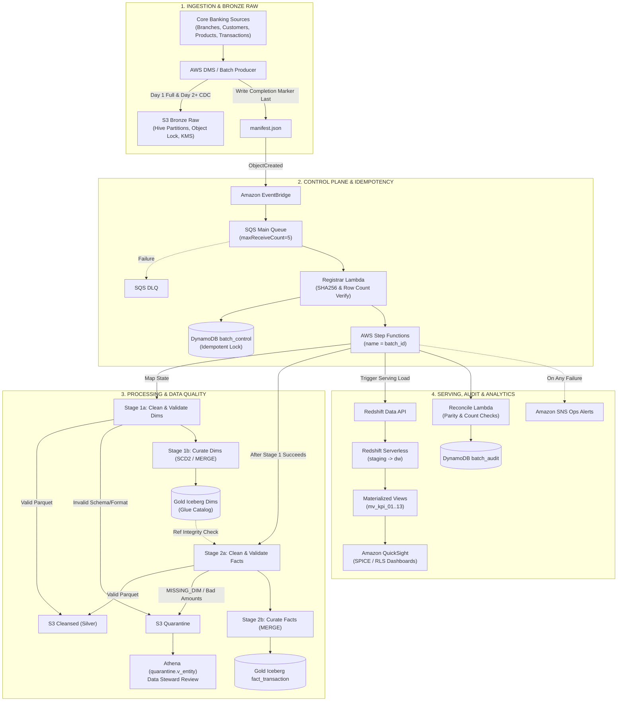
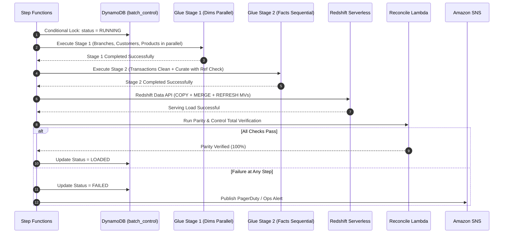
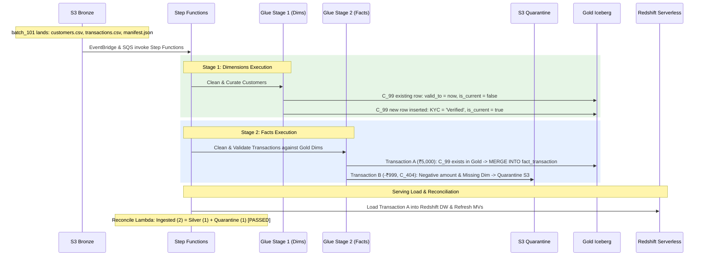

# RetailBank Customer Transaction Analytics Platform
## System Design, Architecture Specification & Evaluation Defense Guide

---

## 1. High-Level Architectural Philosophy

Financial and core banking data pipelines cannot tolerate standard big-data failure modes. They face three fatal pitfalls:
1. **Partial / Race-Condition Loads:** Ingesting `transactions.csv` before `customers.csv` finishes uploading causes valid transactions to fail referential integrity and foreign-key checks.
2. **Silent Data Corruption & Non-Idempotent Retries:** Dropping bad rows silently to "keep the job green", or re-running a failed batch and accidentally double-counting revenue and balances.
3. **Lost History & Non-Auditability:** Overwriting a customer’s `Pending` KYC status with `Verified` in-place destroys historical truth, making it impossible for compliance auditors to reconstruct what the customer's status was at the exact moment a suspicious transaction occurred.

This architecture resolves all three challenges through **four foundational engineering tenets**:

* **Manifest-Driven Eventing:** Downstream compute is never triggered on individual raw file arrivals; it triggers strictly upon atomic arrival of `manifest.json`.
* **Medallion Architecture (Bronze $\rightarrow$ Silver $\rightarrow$ Gold + Quarantine):** Immutable raw storage, zero silent data loss, and dedicated quarantine handling for human stewardship.
* **Two-Stage Dependency DAG:** Dimension datasets (Stage 1) must be cleansed, validated, and merged into Gold before Fact datasets (Stage 2) execute referential integrity lookups.
* **Lakehouse ACID (`Apache Iceberg`) + High-Concurrency Warehouse (`Redshift Serverless`):** Row-level `MERGE INTO`, snapshot time travel, and **SCD Type 2** tracking on cost-effective S3 storage, backed by sub-second pre-computed **Materialized Views** in Redshift for analytics.



---

## 2. Layer-by-Layer Technical Specification

### Layer 1: Ingestion & S3 Bronze Zone (Raw Layer)

| Component | Technology | Primary Function |
| :--- | :--- | :--- |
| **Source Producers** | AWS DMS / Batch Dump Service | Extracts full tables (Day 1) and continuous CDC logs (Day 2+). |
| **Raw Storage** | Amazon S3 Bronze (`bank-dl-raw-<env>`) | Immutable storage partitioned by entity, load type, and batch. |
| **Security & Compliance** | S3 Object Lock + KMS CMK | WORM (Write-Once-Read-Many) compliance (SEC 17a-4 / FINRA). |
| **Completion Marker** | `manifest.json` | Signals downstream workers that all files in the batch are flushed. |

#### Internal Execution Flow:
1. **Partition Structure**: Raw files are written to deterministic Hive paths:
   ```text
   s3://bank-dl-raw/raw/entity=<entity>/load_type=<baseline|incremental>/dt=YYYY-MM-DD/batch_id=<id>/
   ```
2. **Atomic Manifest Emission**: Data files (`customers.csv`, `transactions.csv`, `products.json`, `branches.csv`) land first. The producer flushes `manifest.json` **last**. The manifest includes:
   ```json
   {
     "batch_id": "BATCH_20261006_01",
     "load_type": "INCREMENTAL",
     "cutoff_ts": "2026-10-06T09:00:00Z",
     "files": [
       {
         "s3_uri": "s3://bank-dl-raw/raw/entity=customers/.../data.csv",
         "row_count": 15000,
         "sha256": "e3b0c44298fc1c149afbf4c8996fb92427ae41e4649b934ca495991b7852b855"
       }
     ]
   }
   ```

#### Design Rationale:
* **Why `manifest.json` instead of triggering on raw file creation?**
  Writing large datasets produces split part-files (`part-0000.csv`, `part-0001.csv`). Triggering on file uploads would fire tens of premature, concurrent pipeline executions. Triggering on `manifest.json` guarantees 100% batch presence before compute begins.
* **Why S3 Object Lock in Compliance Mode?**
  Guarantees that raw data cannot be overwritten or deleted even by the AWS root account during the mandatory retention window, fulfilling banking regulatory standards and enabling zero-loss reprocessing.

---

### Layer 2: Control Plane, Buffering & Distributed Idempotency

| Component | Technology | Primary Function |
| :--- | :--- | :--- |
| **Event Routing** | Amazon EventBridge | Filters for `ObjectCreated` events matching `raw/**/manifest.json`. |
| **Shock Absorber** | Amazon SQS (`raw-batch-events`) | Decouples ingestion bursts from compute and absorbs traffic spikes. |
| **Poison-Pill Protection** | Amazon SQS DLQ (`raw-batch-events-dlq`) | Isolates malformed batch manifests after 5 failed retries. |
| **Gatekeeper Function** | AWS Lambda (`Registrar`) | Validates cryptographic hashes, row counts, and issues distributed locks. |
| **Idempotency Store** | Amazon DynamoDB (`batch_control`) | Atomic state tracking preventing duplicate pipeline invocations. |

#### Internal Execution Flow:
1. EventBridge evaluates the object creation prefix and forwards the event to the SQS Main Queue.
2. Registrar Lambda consumes the message:
   * Re-computes SHA-256 hashes of all files in S3 and validates them against the manifest.
   * Compares physical line counts against declared row counts.
   * Executes a conditional write to DynamoDB:
     ```python
     dynamodb.put_item(
         TableName="batch_control",
         Item={"batch_id": {"S": batch_id}, "status": {"S": "RECEIVED"}, "created_at": {"S": now}},
         ConditionExpression="attribute_not_exists(batch_id)"
     )
     ```
   * Starts Step Functions execution with `name=batch_id`.

#### Design Rationale:
* **Why SQS before Lambda?**
  At midnight or end-of-month, dozens of branches flush batches simultaneously. Direct EventBridge-to-Lambda invocation risks hitting concurrency limits. SQS acts as a buffer and provides DLQ visibility.
* **Why DynamoDB conditional write + Named Step Function?**
  SQS provides *at-least-once* delivery. If a message is delivered twice, the second Registrar Lambda invocation fails the conditional write, and the Step Functions call is rejected by AWS as an execution name collision.

---

### Layer 3: Step Functions Orchestration DAG

The entire lifecycle is coordinated by a state machine utilizing AWS SDK integrations (`.sync`):



#### State Definitions:
1. **`ValidateBatch`**: Parses `load_type` (`BASELINE` vs. `INCREMENTAL`).
2. **`Stage1_Dimensions` (Map State, MaxConcurrency = 3)**:
   * Branches: `CleanValidate` $\rightarrow$ `CurateDimension` (Iceberg MERGE).
   * Products: `CleanValidate` $\rightarrow$ `CurateDimension` (Iceberg MERGE).
   * Customers: `CleanValidate` $\rightarrow$ `CurateDimension` (Iceberg SCD Type 2).
3. **`Stage2_Facts` (Sequential)**: Executes **only after all Stage 1 dimensions succeed**.
   * `CleanValidate` (verifies foreign keys against updated Gold dimensions).
   * `CurateFact` (Iceberg MERGE for transactions & reversals).
4. **`RedshiftLoad`**: Dispatches transactional SQL via the Redshift Data API.
5. **`Reconcile`**: Audits mathematical row and currency conservation.
6. **`MarkLoaded` / Catch Block**: Sets final batch state or alerts operations via SNS.

---

### Layer 4: Processing & Data Quality Engine (Silver & Quarantine)

Implemented via **AWS Glue 4.0 (PySpark on G.1X workers)** using externalized YAML data quality configurations.

#### Cleansing & Transformation Rules:
* **Products (`products.json`)**:
  * Employs a resilient parser that handles concatenated or malformed JSON payloads.
  * Normalizes boolean flags (`"true"`, `1`, `"yes"` $\rightarrow$ `True`).
  * Enforces positive pricing (`price > 0.00`).
* **Customers (`customers.csv`)**:
  * Unifies multi-format dates (`YYYY-MM-DD`, `DD/MM/YYYY`, `MM-DD-YYYY`).
  * Normalizes KYC status values (`VERIFIED`, `v`, `Verified` $\rightarrow$ `Verified`).
  * Quarantines future dates of birth (`dob > CURRENT_DATE`) and invalid email formats.
  * Resolves account conflicts where two customer entities share a duplicate `account_id`.
* **Transactions (`transactions.csv`)**:
  * Strips currency symbols (`"₹"`, `","`) and casts amounts to `DECIMAL(18,2)`.
  * Resolves timestamp vs. date discrepancies.
  * Quarantines zero or negative amounts (`amount <= 0`).
  * **Referential Integrity Check**: Performs broadcast joins against Gold `dim_customer`, `dim_product`, and `dim_branch`. If any foreign key is missing, the transaction is routed to Quarantine with `error_code = 'MISSING_DIM'`.

#### Output Routing:
* **Valid Rows** $\rightarrow$ `s3://bank-dl-cleansed/<entity>/batch_id=<id>/` (Snappy-compressed Parquet).
* **Invalid Rows** $\rightarrow$ `s3://bank-dl-quarantine/<entity>/batch_id=<id>/` (Appended with metadata columns: `error_code`, `error_detail`, `rule_id`, `raw_payload`).
* **Data Steward Interface**: Quarantined records are queryable through **Amazon Athena** views (`quarantine.v_<entity>`), allowing operational inspection without polluting production warehouses.

---

### Layer 5: Curated Lakehouse Layer (S3 Gold + Apache Iceberg)

Registered in the **AWS Glue Data Catalog**, the Gold layer utilizes **Apache Iceberg** table format.

#### Dimension Management: Slowly Changing Dimensions (SCD Type 2)
For entities requiring historical auditability (specifically `dim_customer` tracking `kyc_status`, `risk_tier`, and address):
* A deterministic hash is calculated:
  $$\text{row\_hash} = \text{SHA256}(\text{kyc\_status} \parallel \text{address} \parallel \text{risk\_tier})$$
* When an incoming record contains an existing `account_id` but a modified `row_hash`:
  1. The active record in Gold is expired:
     $$\text{valid\_to} = \text{cutoff\_ts}, \quad \text{is\_current} = \text{false}$$
  2. A new record is inserted:
     $$\text{customer\_sk} = \text{UUID}(), \quad \text{valid\_from} = \text{cutoff\_ts}, \quad \text{valid\_to} = \text{'9999-12-31'}, \quad \text{is\_current} = \text{true}$$
* If the `row_hash` matches the active record, the update is skipped, guaranteeing idempotent re-execution.

#### Fact Management: ACID `MERGE INTO`
Transactions are merged using Iceberg's row-level mutation engine:
```sql
MERGE INTO gold.fact_transaction target
USING silver_transactions source
ON target.transaction_id = source.transaction_id
WHEN MATCHED AND source.is_reversal = true THEN
  UPDATE SET target.status = 'REVERSED', target.updated_at = source.commit_ts
WHEN MATCHED THEN
  UPDATE SET target.amount = source.amount, target.status = source.status, target.updated_at = source.commit_ts
WHEN NOT MATCHED THEN
  INSERT (transaction_id, account_id, branch_id, product_id, amount, status, transaction_timestamp)
  VALUES (source.transaction_id, source.account_id, source.branch_id, source.product_id, source.amount, source.status, source.transaction_timestamp);
```

#### Why Apache Iceberg Over Plain Parquet:
* **Row-Level Mutations**: Plain Parquet requires rewriting entire partitions to update a single transaction reversal.
* **ACID Guarantees**: Readers never see uncommitted or partial batch writes.
* **Snapshot Time Travel**: Enables querying the lakehouse at historical points in time:
  ```sql
  SELECT * FROM gold.fact_transaction FOR SYSTEM_TIME AS OF '2026-10-01 00:00:00';
  ```

---

### Layer 6: Serving, Reconciliation & Business Intelligence

| Component | Technology | Primary Function |
| :--- | :--- | :--- |
| **Serving Warehouse** | Amazon Redshift Serverless | High-concurrency analytical engine running over `staging`, `dw`, and `kpi` schemas. |
| **Data API** | Amazon Redshift Data API | Asynchronous, connectionless SQL execution managed by Step Functions. |
| **Pre-Calculated Views** | Materialized Views (`mv_kpi_01..13`) | Sub-second aggregation for compute-intensive analytical queries. |
| **Automated Auditor** | Reconcile Lambda + DynamoDB | Evaluates row conservation and currency totals before publishing. |
| **Visual Analytics** | Amazon QuickSight | Enterprise dashboards with Row-Level Security (RLS) enforcement. |

#### Automated Reconciliation Mathematical Invariants:
The Reconcile Lambda enforces four strict invariants prior to marking a batch successful:

$$\text{1. Conservation of Rows: } N_{\text{manifest}} = N_{\text{silver\_valid}} + N_{\text{quarantine}}$$

$$\text{2. Financial Control Total: } \sum \text{Amount}_{\text{silver\_valid}} = \sum \text{Amount}_{\text{gold\_merged}}$$

$$\text{3. Key Coverage: } \text{Keys}(\text{Silver}) \subseteq \text{Keys}(\text{Gold})$$

$$\text{4. Warehouse Parity: } \text{Count}(\text{Gold Iceberg}) = \text{Count}(\text{Redshift } dw.\text{fact\_transaction})$$

Results are written to `DynamoDB batch_audit`. If any condition fails, the Redshift staging transaction is rolled back, and an alert is dispatched via SNS.

---

### Layer 7: Security, Compliance & Observability Matrix

```
                        ┌──────────────────────────────────────────────┐
                        │              AWS Lake Formation              │
                        │    (Central Column/Row-Level Permissions)    │
                        └──────────────────────┬───────────────────────┘
                                               │
             ┌─────────────────────────────────┼─────────────────────────────────┐
             ▼                                 ▼                                 ▼
┌─────────────────────────┐       ┌─────────────────────────┐       ┌─────────────────────────┐
│     AWS KMS (CMK)       │       │      Amazon Macie       │       │  VPC PrivateLink (No    │
│ Envelope Encryption at  │       │ Automated PII & Leak    │       │ Public Internet Transit)│
│ Rest (S3, DDB, SQS, RS) │       │ Detection in S3 Bronze  │       │ Lambda, Glue, S3, RS    │
└─────────────────────────┘       └─────────────────────────┘       └─────────────────────────┘
```

* **Lake Formation**: Centralizes column-level masking over the Glue Catalog. PII fields (`phone`, `email`, `dob`) are masked for reporting analysts while remaining unmasked for authorized compliance roles (`pii_reader`).
* **Amazon Macie**: Continuously inspects S3 Bronze Raw to catch unmasked credit card numbers or national IDs accidentally included by upstream source feeds.
* **VPC Endpoints (PrivateLink)**: Ensures all communication between Lambda, Glue, S3, DynamoDB, and Redshift stays strictly inside the AWS private network backbone.

---

## 3. End-to-End Concrete Example: Tracing a Real Batch

### Scenario:
A morning incremental batch (`BATCH_101`) arrives containing:
1. **Customer Record**: Customer `C_99` changes KYC status from `Pending` to `Verified`.
2. **Transaction Record A**: Customer `C_99` executes a valid transaction of `₹5,000.00`.
3. **Transaction Record B**: A corrupted transaction of `-₹999.00` referencing non-existent customer `C_404`.



---

## 4. Architectural Defense & Counterquestion Battlecard

Use these structured responses during technical evaluations and defense panels:

---

### Question 1: "Why trigger EventBridge on `manifest.json` instead of triggering directly on individual `.csv` or `.json` file arrivals?"
> **Defense:**
> *"Triggering on raw data file arrivals introduces a distributed race condition. Upstream batch jobs write multi-part files over several seconds or minutes. 
> 
> If we triggered on raw files, EventBridge would launch four concurrent Step Functions executions while data was still actively being uploaded. Downstream jobs would attempt referential integrity checks on partially uploaded files, resulting in false `MISSING_DIM` failures. 
> 
> By enforcing the **Manifest Completion Marker Pattern**, the producer writes data files first and emits `manifest.json` last. This guarantees 100% batch completeness before a single compute resource is provisioned, while providing file-level SHA-256 integrity validation."*

---

### Question 2: "Why place SQS and DynamoDB between EventBridge and Step Functions instead of invoking Step Functions directly?"
> **Defense:**
> *"This solves two critical challenges: **burst smoothing** and **strict idempotency**.
> 
> 1. **Burst Smoothing**: If dozens of source systems flush end-of-day batches at midnight, direct invocation can cause throttling. SQS buffers incoming events and isolates unparseable payloads using a Dead-Letter Queue (`maxReceiveCount = 5`).
> 2. **Distributed Idempotency**: SQS operates under *at-least-once* delivery semantics, meaning duplicate deliveries can occur. The Registrar Lambda uses DynamoDB conditional writes (`attribute_not_exists(batch_id)`) and passes `batch_id` as the unique Step Functions execution name. If a duplicate event arrives, it is safely rejected at zero compute cost, preventing duplicate transactions in our ledger."*

---

### Question 3: "Why enforce a two-stage sequential dependency (Dimensions parallel in Stage 1, Facts in Stage 2)?"
> **Defense:**
> *"Financial transactions cannot exist without valid parent dimensions. If we ran Dimensions and Facts concurrently on an incremental Day 2 load, a transaction belonging to a customer who registered five minutes prior would fail referential integrity checks because the customer record would still be processing in the adjacent worker.
> 
> Our architecture uses a **Two-Stage DAG**:
> * **Stage 1 (Map State)** cleanses and merges `Branches`, `Products`, and `Customers` into Gold concurrently with `MaxConcurrency = 3`.
> * **Stage 2** executes only after Stage 1 commits. When transactions run referential checks, all newly registered accounts, updated KYC statuses, and active branches are already committed in the Gold layer."*

---

### Question 4: "Why use Apache Iceberg on S3 Gold instead of standard Parquet files?"
> **Defense:**
> *"Plain Parquet on S3 is immutable. Applying an `UPDATE` or `DELETE` requires reading the entire partition, modifying the rows in memory, and rewriting the entire folder back to S3. In a banking pipeline handling late-arriving transaction corrections, reversals, and SCD Type 2 updates, this approach is computationally prohibitive and violates our low-latency SLAs.
> 
> Apache Iceberg introduces:
> 1. **ACID Row-Level Mutations**: Native `MERGE INTO` support that updates transaction statuses in place without partition rewrites.
> 2. **Snapshot Isolation & Time Travel**: Allows regulatory auditors to query historical table states at any point in time (`AS OF snapshot_id`) for reconciliation without taking offline backups."*

---

### Question 5: "Why maintain an S3 Quarantine zone and Athena interface instead of dropping malformed rows?"
> **Defense:**
> *"Silent data loss is unacceptable in financial systems. If a transaction has a malformed decimal or references a temporarily delayed customer record, discarding it creates discrepancies between source ledgers and downstream reporting.
> 
> Our architecture routes rejected rows to partitioned **S3 Quarantine** with diagnostic metadata (`error_code`, `rule_id`, `raw_payload`). Data Stewards inspect bad records in SQL using **Amazon Athena** (`quarantine.v_<entity>`). Once upstream systems push corrections or delayed parent dimensions, our **Reprocess Workflow** re-injects the quarantined records into the pipeline without requiring full-batch reloads."*

---

### Question 6: "Why use both S3 Gold Iceberg and Redshift Serverless? Isn't maintaining both redundant?"
> **Defense:**
> *"They serve two fundamentally different operational profiles:
> 1. **S3 Gold Iceberg is the Central Lakehouse Source of Truth**: It holds petabytes of multi-year, immutable, audited data at low object-storage costs, accessible by any engine (Athena, Spark, EMR) without database vendor lock-in.
> 2. **Redshift Serverless is the High-Concurrency Serving Engine**: Business users and executive dashboards demand sub-second response times across complex queries (such as 10-minute sliding window fraud aggregations or multi-tier RFM analytics). 
> 
> Redshift Serverless pre-computes these calculations using **Materialized Views (`mv_kpi_01..13`)** and auto-scales compute during peak query traffic, shielding the central data lake from query contention."*
